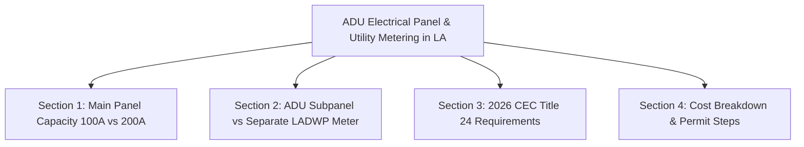

# Content Brief: ADU Electrical Panel & Utility Metering Guide (Los Angeles)

**Target URL**: `blog/adu-electrical-panel-requirements-la.html`  
**Target Audience**: Los Angeles property owners, ADU builders, and real estate investors.  
**Primary Target Keyword**: `ADU electrical panel requirements Los Angeles`  
**Secondary Keywords**: `ADU subpanel cost LA`, `secondary electric meter ADU LADWP`, `ADU electrical wiring permit`  
**Intent**: Informational / Commercial  

---

## 1. Page Title & Meta Specification

- **Title Tag**: `ADU Electrical Panel Requirements LA | Subpanel & Meter Guide | AMY Electric`
- **Meta Description**: `Complete guide to ADU electrical panel requirements in Los Angeles: subpanels, LADWP dual meters, costs, and LADBS permits. Call AMY Electric at (818) 302-5614.`
- **Canonical URL**: `https://amyelectric.com/blog/adu-electrical-panel-requirements-la`

---

## 2. Article Outline & Required Sections

### Section 1: Main Panel Capacity Check
- Does your main 100A panel have enough capacity for an ADU with mini-split HVAC, electric water heater, and kitchen appliances?
- Why a **200A or 400A main service upgrade** is often required before feeding an ADU.

### Section 2: ADU Subpanel vs. Dedicated Utility Meter
- **Option A: 100A Subpanel fed from Main House**: Ideal for single-family rentals; lower upfront cost.
- **Option B: Dedicated LADWP / SCE Secondary Meter**: Required for independent utility billing on long-term rental ADUs.

### Section 3: 2026 California Electrical Code (CEC) & LADBS Rules
- Dedicated AFCI/GFCI breaker protection.
- Solar-ready conduit requirements under Title 24.
- Underground trenching & conduit sizing rules between main house and detached ADU.

### Section 4: Estimated Costs & LADBS Permitting Steps
- Subpanel installation: $1,200 – $2,500.
- Main service upgrade (200A): $2,200 – $4,500.
- LADBS plan check & permit process handled by AMY Electric.

---

## 3. Internal Links & CTAs

- Link to [`/panel-upgrade.html`](https://amyelectric.com/panel-upgrade)
- Link to [`/adu-electrical.html`](https://amyelectric.com/adu-electrical)
- Primary CTA: **Call AMY Electric at (818) 302-5614 for a Free ADU Electrical Inspection & Estimate.**
