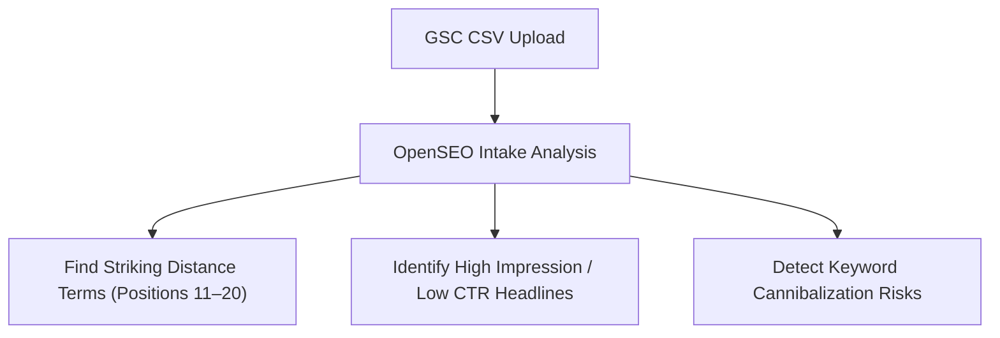

# Google Search Console (GSC) Data Intake Guide

**Workspace Folder**: [`seo-workspace/gsc/`](file:///home/amram/WEBSITE/seo-workspace/gsc)  
**Target Domain**: [AMY Electric](https://amyelectric.com) (`amyelectric.com`)  

---

## 1. How to Export GSC Data

1. Log into your [Google Search Console](https://search.google.com/search-console) account.
2. Select your property: `https://amyelectric.com` (or `sc-domain:amyelectric.com`).
3. Click on **Performance** $\rightarrow$ **Search results** in the left navigation sidebar.
4. Set the Date Range to **Last 3 months** (or **Last 16 months** for seasonal comparison).
5. Click the **Export** button in the top right corner and select **Download CSV**.

---

## 2. Recommended File Names & Locations

Unzip the downloaded package and drop the relevant CSV files into [`seo-workspace/gsc/`](file:///home/amram/WEBSITE/seo-workspace/gsc) using these names:

- `seo-workspace/gsc/queries-last-3-months.csv` (Top search queries)
- `seo-workspace/gsc/pages-last-3-months.csv` (Top landing pages)
- `seo-workspace/gsc/queries-last-16-months.csv` (Long-term query trends)

---

## 3. What We Will Analyze Once Uploaded

Once you drop the CSV files into `seo-workspace/gsc/`:

1. **Striking Distance Opportunities**: Identify high-intent keywords ranking between positions **11 and 20** that can be pushed to Page 1 with minor title/heading tweaks.
2. **CTR Optimization**: Find pages with high impressions but low click-through rates (CTR) to refine meta descriptions & titles.
3. **Cannibalization Risks**: Highlight multiple URLs competing for the exact same query phrase.
